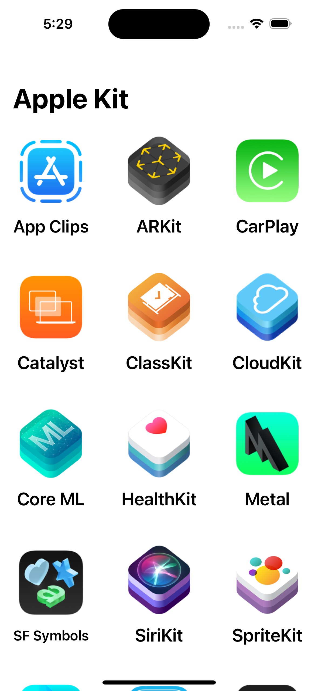
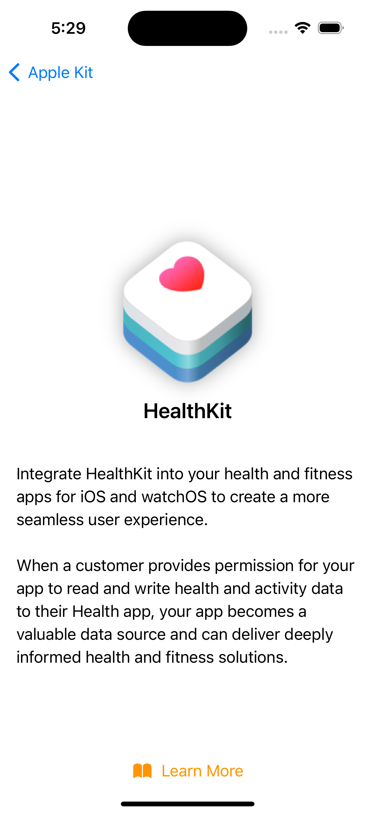
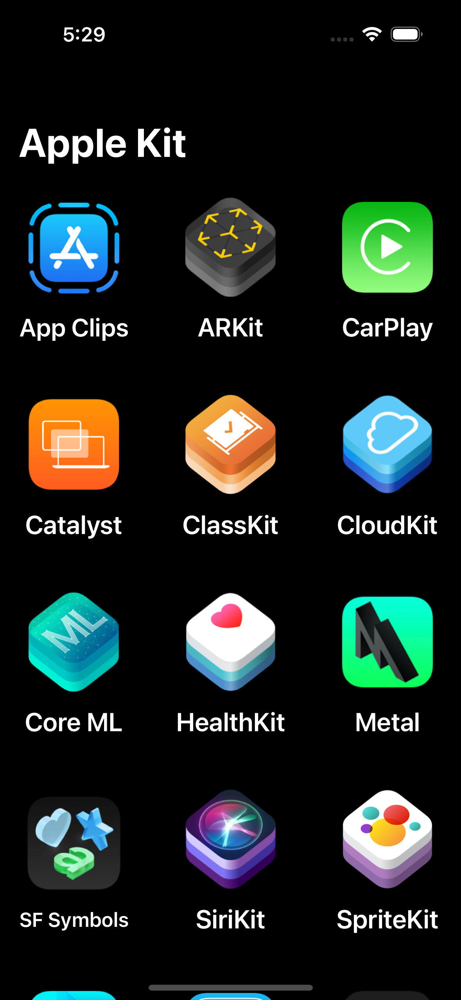
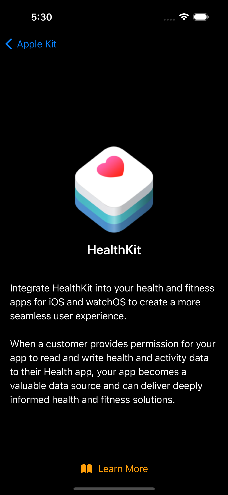

# SwiftUi-AppleFrameworks

A beautiful SwiftUI app demonstrating popular Apple frameworks. Browse, explore, and learn about frameworks with an intuitive interface supporting both Light and Dark modes!

## Features

- Curated list of Apple frameworks with details and logos
- Smooth and modern SwiftUI interface
- Supports Light and Dark modes
- Easy navigation and exploration

## Screenshots

### Light Mode

<p align="center">
  
  
</p>

### Dark Mode

<p align="center">
  
  
</p>

> Replace the screenshot filenames above with your actual uploaded files.

## Getting Started

1. **Clone the repository**

    ```bash
    git clone https://github.com/w77sh/SwiftUi-AppleFrameworks.git
    ```

2. **Open in Xcode and Run**

    - Open `SwiftUi-AppleFrameworks.xcodeproj` in Xcode.
    - Select a simulator or device and press `Run` (⌘+R).

## Requirements

- Xcode 13 or newer
- iOS 15.0+

## Contributing

Pull requests and issues are welcome!

## License

MIT

---

Made with ❤️ using SwiftUI.
